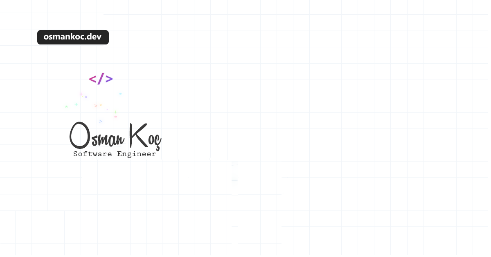

# My Personal Website

My personal website built with Next.js and Tailwind CSS. Uses Medium as a headless CMS for blog posts and Raindrop.io for managing bookmarks.



## Features

- ⚡️ Built with Next.js 14 and TypeScript
- 💨 Tailwind CSS for styling
- 🎨 Shadcn UI components
- 🌙 Dark mode support
- 📱 Fully responsive
- 📝 Medium integration for blog posts
- 🔖 Raindrop.io integration for bookmarks
- 🖼️ Gravatar for profile image
- 🎯 Perfect Lighthouse score
- 🤖 Play.AI for voice agent

## Tech Stack

- [Next.js](https://nextjs.org)
- [TypeScript](https://www.typescriptlang.org)
- [Tailwind CSS](https://tailwindcss.com)
- [Shadcn UI](https://ui.shadcn.com)
- [Medium RSS](https://medium.com) (as Headless CMS)
- [Raindrop.io](https://raindrop.io) (for Bookmarks)

## Getting Started

1. Clone this repository:
```bash
git clone https://github.com/osman-koc/my-web-site.git
```

2. Install dependencies:
```bash
npm install
```

3. Create a `.env.local` file in the root directory:
```bash
# Raindrop.io API Token (Required for bookmarks)
# Get your token from: https://app.raindrop.io/settings/integrations
RAINDROP_ACCESS_TOKEN=your_token_here
# play.ai voice agent
# Create your special agent from: https://play.ai/
PLAYAI_API_KEY=your_key
```

4. Start the development server:
```bash
npm run dev
```

## Configuration

To customize this website for your own use, you'll need to modify the following:

1. Update personal information in:
   - `app/page.tsx` (introduction)
   - `app/lib/shared-metadata.tsx` (metadata)
   - `components/sidebar.tsx` (name, social links)

2. Update Medium RSS feed URL in `lib/medium.ts` to your Medium profile

3. Configure Raindrop.io:
   - Create an account at [Raindrop.io](https://raindrop.io)
   - Go to [Integrations](https://app.raindrop.io/settings/integrations)
   - Create a new app and generate a permanent token
   - Add the token to `.env.local`

4. Modify the journey timeline in `app/journey/page.tsx`

5. Update workspace items in `lib/workspace.ts`

6. Update tools list in `app/tools/page.tsx`

7. Update projects in `lib/projects.ts`

## Development

This project was developed using [Bolt.new](https://bolt.new), an AI-powered development environment that provides real-time assistance and code generation.

## Credits

- Design inspired by [onur.dev](https://github.com/suyalcinkaya/onur.dev)
- Built with [Bolt.new](https://bolt.new)
- Icons from [Lucide](https://lucide.dev)
- UI Components from [Shadcn UI](https://ui.shadcn.com)

## License

MIT License - feel free to use this code for your own personal website!
